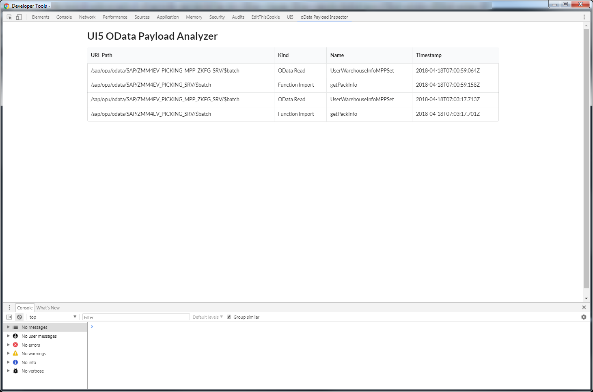
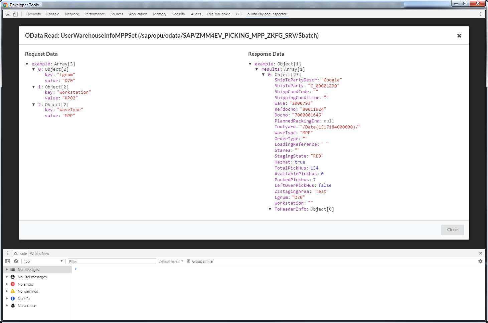
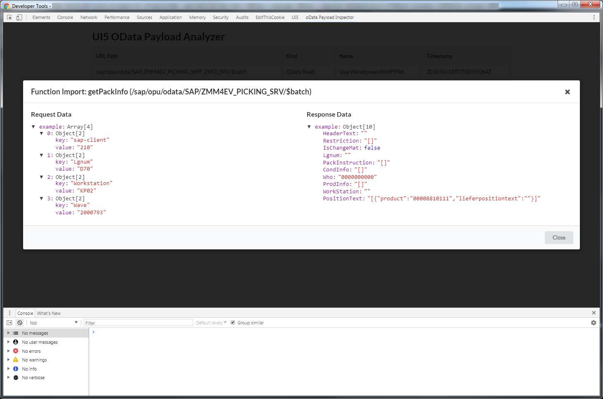

# chrome-odata-viewer

Displays the UI5 OData network requests in a beautified clickable way like JSON.

## Installation

1. Download the source code as zip file [here](https://github.com/mxschmitt/chrome-odata-viewer/archive/master.zip).
2. Unzip to get the content.
3. Install the global needed npm packages `browserify` and `shx` via `npm install -g browserify shx` or `yarn global add browserify shx`.
3. Install the local npm packages by running `npm install` or `yarn install` in the directory.
4. Navigate to the extensions page (or visit: `chrome://extensions/` directly).
5. Install the unpacked extension in Chrome by clicking on the `LOAD UNPACKED` button and selecting the extracted directory there.

## Requirements

- Chrome
- NPM to install the necessary packages

## How to

To use this extension, you have to open the Chrome DevTools and open the `OData Payload Inspector` tab. Only if you have opened the tab once, backend calls will be recorded.

Here you can see an example OData read http call.

And here a function import call. On the right side you see the response data and on the left side the request data which was sent to the backend.